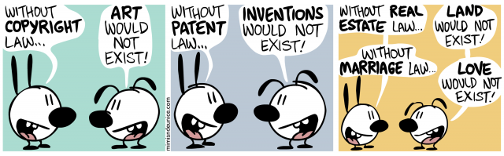

# Public Talks
Code snippets and examples used in my public talks given in 2017 and onwards.

## Talks
Talks, ordered alphabetically:

- [C++ Package Managers - At Long Last](CppPackageManagersAtLongLast)
- [Losing Weight With C# 7+](LosingWeightWithCSharp7+)
- [Super-powers and the Compiler](SuperPowersAndTheCompiler)

## License
The code snippets and examples are neither licensed nor copyrighted. You can do whatever you want with them as long as you don't say you created them yourself ;-) In case of (re)use, providing a link to this GitHub repository would be highly appreciated, but it's not mandatory.

    

